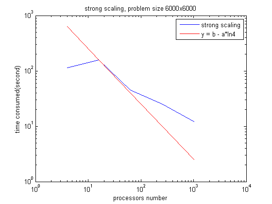
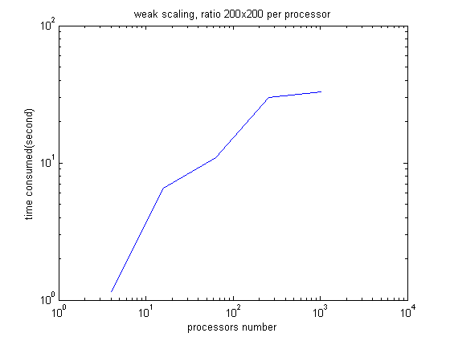
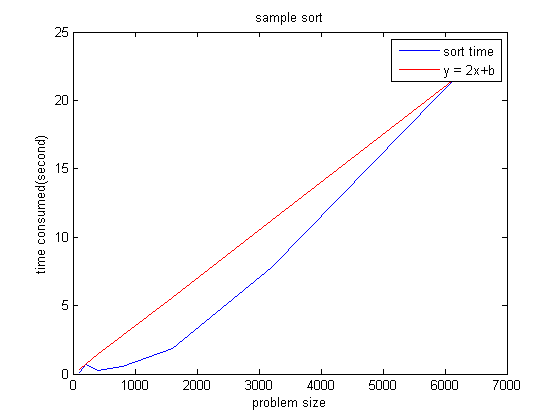

# homework4

MPI_bug1: Tags of send and receive don't match.

MPI_bug2: Data types of send and receive don't match, received as int and then cast to float.

MPI_bug3: Missing init and finalize statement.

MPI_bug4: Reduce statement can't be seen by all mpi task.

MPI_bug5: Data should be received accumulating in the buffer.

MPI_bug6: Initial value of offset should be 0; request not used by task 2, either set nreqs=0 or skip waitall for rank 2.

MPI_bug7: count should be 1 for send and receive.

Jacobi-2D

Sample Sort

